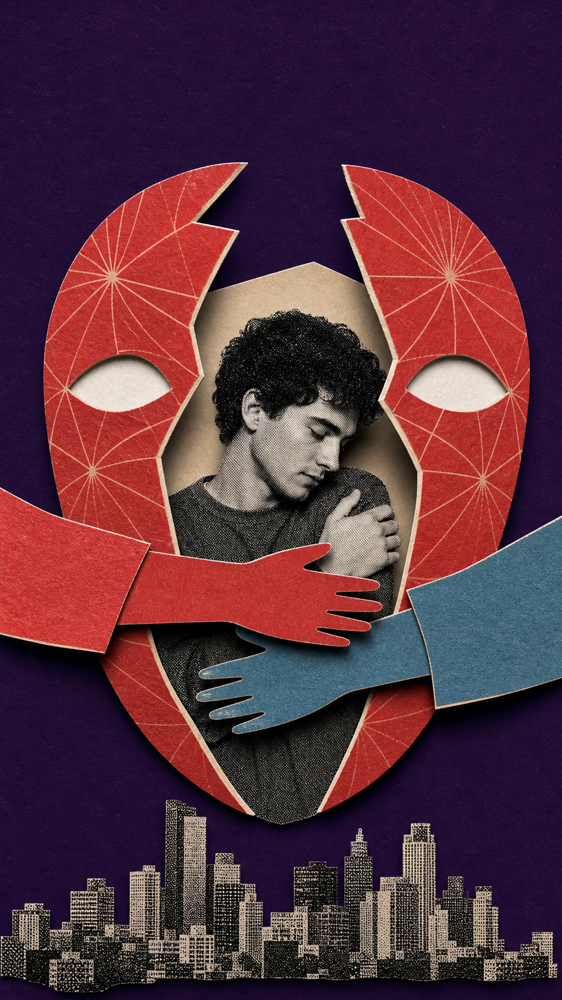
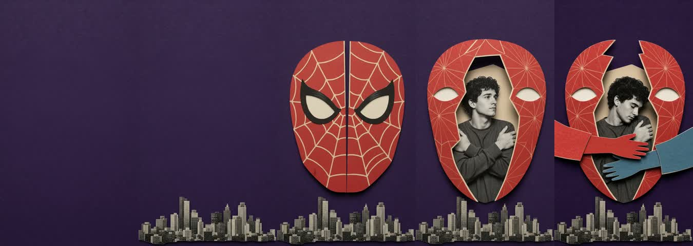
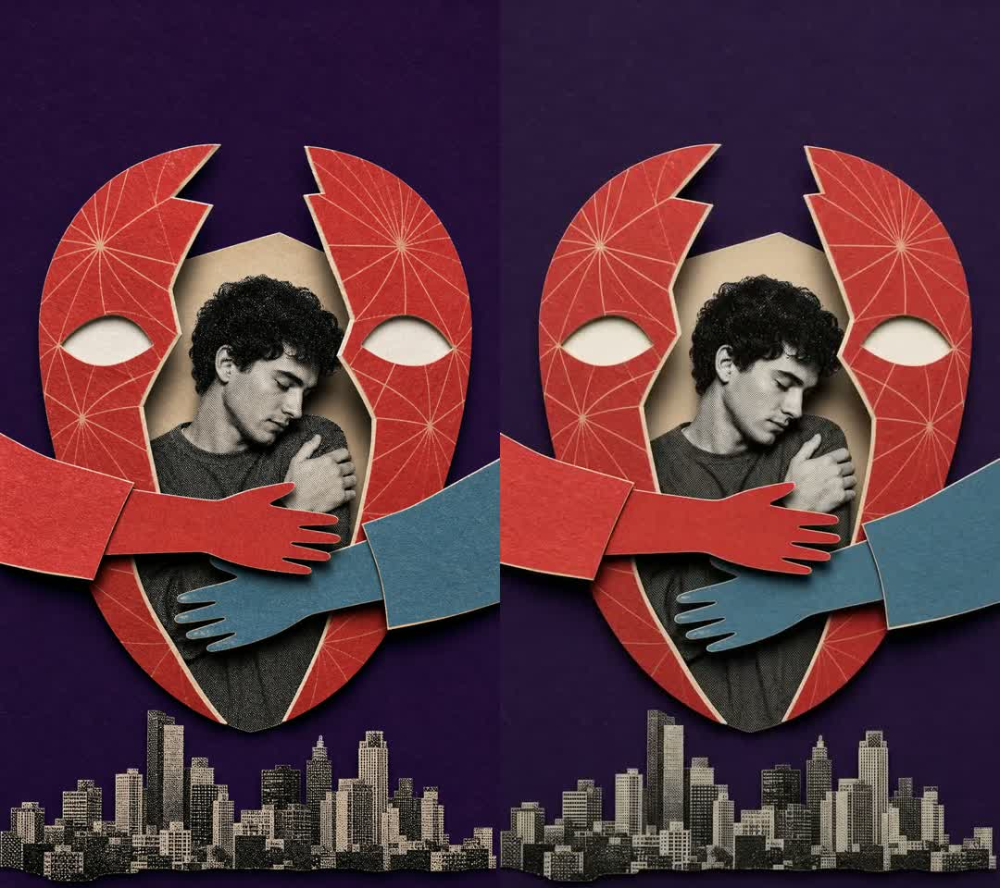

<div align="center">

# Hey, I'm Dalei 👋

### AI 实践派 · 把灵感做成可以反复运行的系统

I turn AI experiments into reusable skills, creative workflows, and visual stories.

[](https://github.com/paul010/dalei-youtube)
[](https://github.com/paul010/daleibroll)

</div>

---

## 🎬 Featured Build — Dalei B-roll

> 蜘蛛侠可以拯救整座城市，却要到最后才学会拥抱面具后的彼得·帕克。

<div align="center">
  <a href="assets/dalei-broll/dalei-broll-demo.mp4">
    
  </a>
  <br>
  <sub>点击动图观看 5 秒高清无声 MP4</sub>
</div>

### 这不是一次 Prompt 抽奖

我把一句口播稿做成了一条可以复用、可以审批、可以验证的创作流水线：

```text
口播稿 → 视觉隐喻 → 静帧审批 → Omni 组装动画 → 逐帧 QA
```

| Gate | 我在判断什么 | 产物 |
|:---:|---|---|
| **01 · Metaphor** | 观众真正应该看懂什么？ | 一个清晰的视觉命题 |
| **02 · Still** | 隐喻、构图和纸张质感是否成立？ | 可确认的 9:16 拼贴静帧 |
| **03 · Motion** | 元素是否从空场逐件组装，而不是简单 Zoom？ | 5 秒无声 B-roll + 完整 QA |

### From still to motion

<table>
  <tr>
    <td width="42%" align="center">
      
      <br><b>Approved Still</b>
    </td>
    <td width="58%" valign="top">
      <h4>视觉命题</h4>
      <p>巨大的红色面具像纸壳一样打开，普通的自己从里面出现，两侧英雄手臂最终合拢，将他抱住。</p>
      <h4>视觉语言</h4>
      <p>深紫纯色纸场 × 黑白 Halftone × 红蓝卡纸 × 奶油白裁边。</p>
      <h4>交付规格</h4>
      <p><code>9:16</code> · <code>720×1280</code> · <code>24fps</code> · <code>5s</code> · <code>No Audio</code></p>
      <p>
        <a href="https://github.com/paul010/daleibroll"><b>Explore the Skill →</b></a><br>
        <a href="assets/dalei-broll/dalei-broll-demo.mp4"><b>Watch the MP4 →</b></a>
      </p>
    </td>
  </tr>
</table>

### The assembly, second by second



### QA is part of the creative work

生成不是终点。我检查真实首帧、逐秒动作、音轨、分辨率，以及确认静帧和视频末帧是否一致。



---

## 🧩 What I Build

- **Agent Skills** — 把一次成功，沉淀成下一次可以直接调用的能力
- **AI Video Workflows** — 从脚本、视觉隐喻到可验证的最终成片
- **Creative Systems** — 在审美判断和自动执行之间设计清晰闸门

## 🚧 Currently Exploring

- [**Dalei B-roll**](https://github.com/paul010/daleibroll) — 半调纸拼贴 B-roll 的三闸门 Agent Skill
- [**大雷早上好**](https://github.com/paul010/dalei-youtube) — AI 实践频道的提示词、工具与深度笔记

<div align="center">

### Build boldly. Verify carefully. Share what works.

如果你也在把 AI 从“看起来很酷”变成“真的能工作”，欢迎来聊。

</div>
